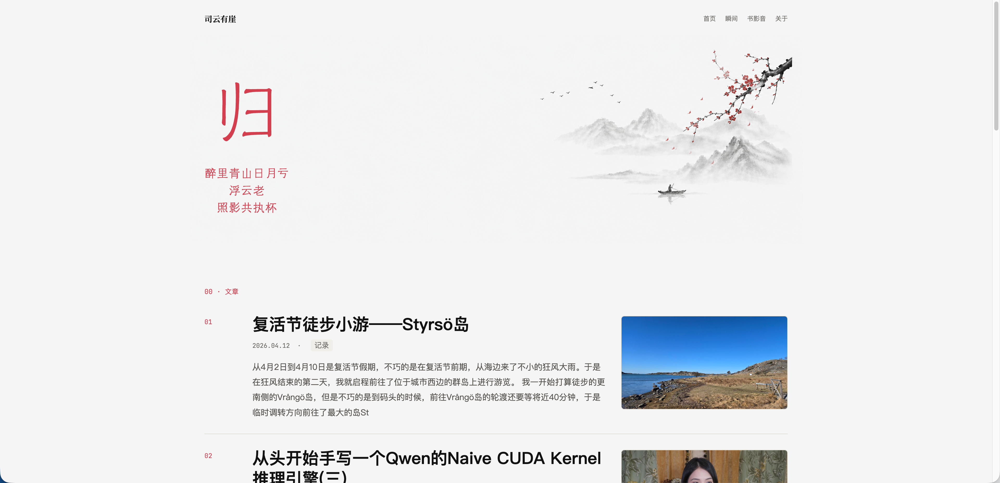

# 归

一款面向 [Halo](https://www.halo.run/) 的传统水墨风格博客主题。

预览地址：[eduardoqian.com](https://eduardoqian.com)



## 设计思路

主题以传统水墨画的留白、墨色层次和题跋气质为主要灵感，整体视觉保持克制、疏朗和安静。首页以大幅背景与书法字体构成第一印象，用一枚醒目的题字和可配置诗词建立东方意境；内容区域则尽量减少装饰，让文章列表、时间、分类和摘要以清晰的节奏铺开。

配色上采用接近宣纸的浅灰底色、深墨文字和少量朱红点缀，形成类似印章与题字的视觉关系。版式上强调空白与纵深，避免过度卡片化，使博客阅读体验更接近一页安静展开的纸本册页。

## 开发指南

### 环境要求

- Node.js 18+
- pnpm

### 安装依赖

```bash
pnpm install
```

### 开发模式

```bash
pnpm dev
```

### 打包构建

```bash
pnpm build
```
